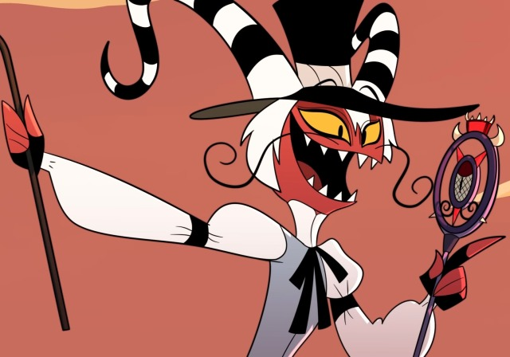

# Wackford 😈

I say, I say! Are **you** looking for some **Discord bot frameworks**?
Well boy do I have something for you...

## MEET WACKFORD

The worlds **best** bot framework for 🦖**Deno** powered by **[Discordeno](https://github.com/discordeno/discordeno)**.

## Features

- A **devilishly 😈😈 good** event emitter
- A **stylish** name
- The best **banner** ever

## FAQ

**Q**: Why?  
**A**: Why not?

**Q**: Why is this README so bad?  
**A**: See the answer for the first question.

**Q**: Should I use ths in production?  
**A**: Probably not (but who are we to stop you!).

**Q**: Do you have documentation?  
**A**: That's like asking The Lacs to make good music.

**Q**: Can I get support?  
**A**: Only if you listen to money machine by 100 gecs for 100 years.  
  
  
  
Wally Wackford is trademark of Spindlehorse Toons (probably), and we do not claim ownership in any way, shape, or form.
